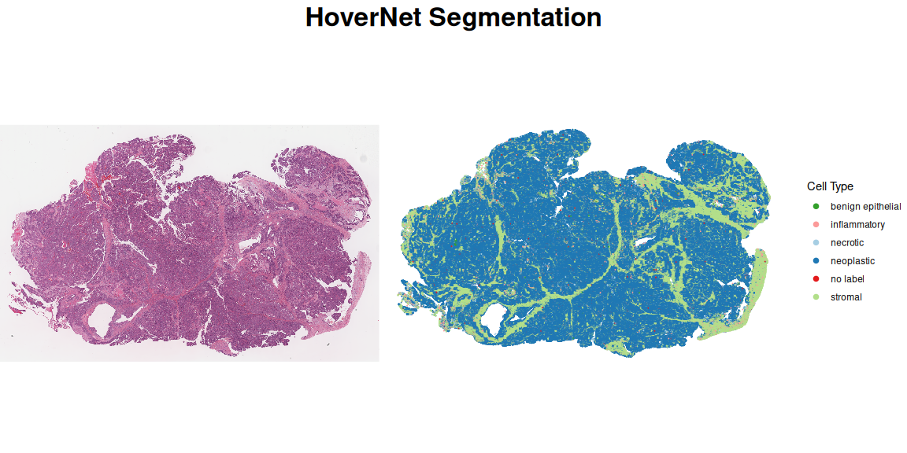
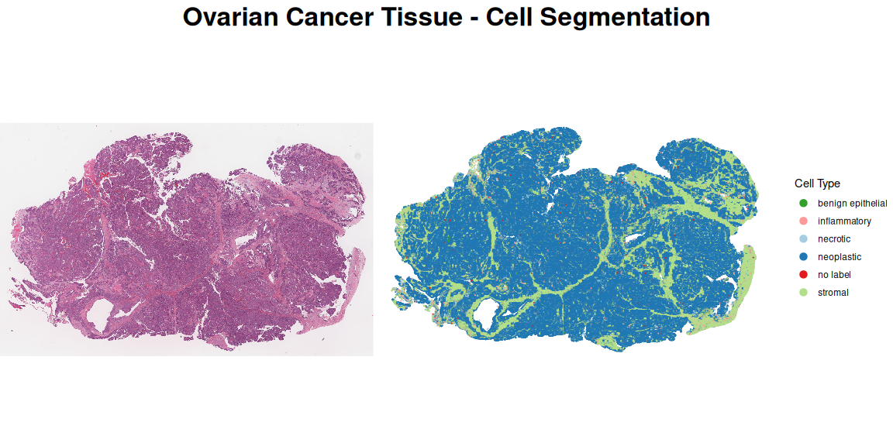
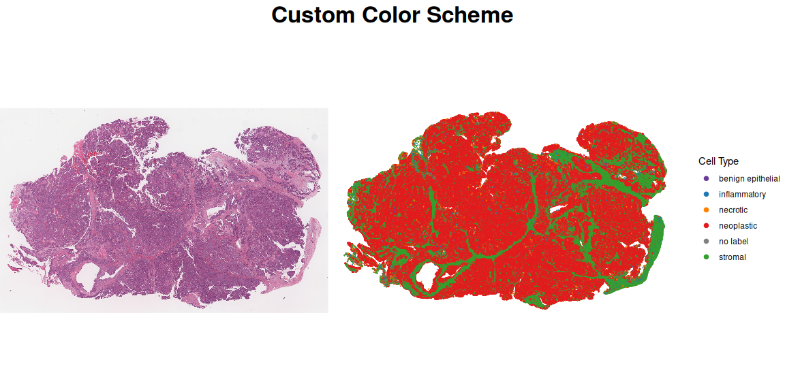
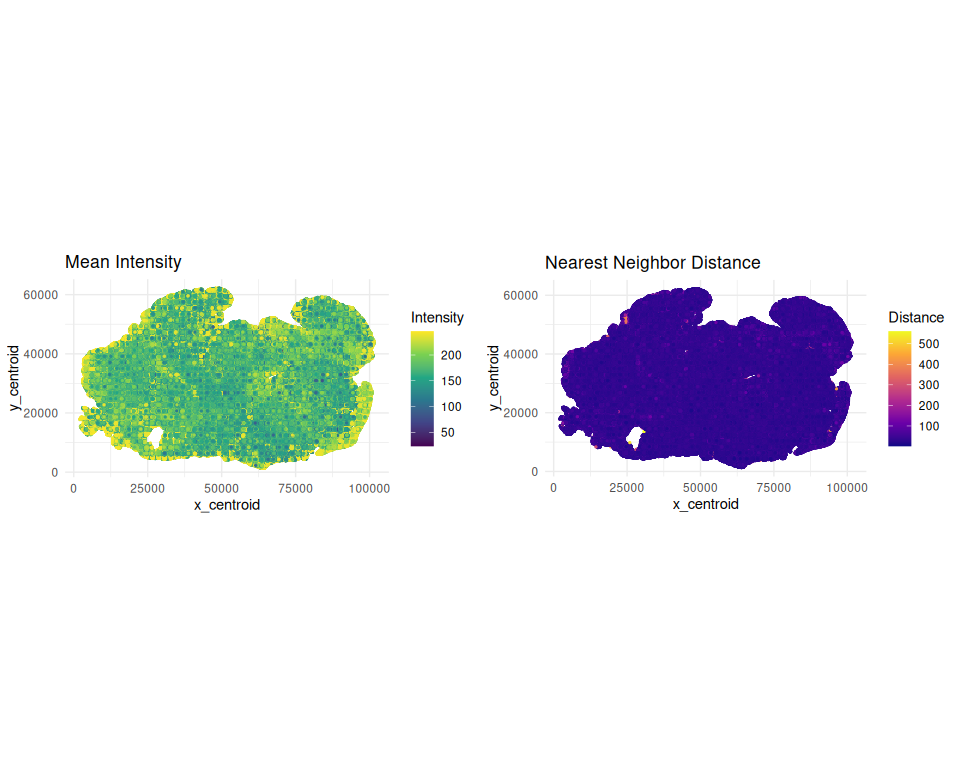

# imageFeatureTCGA

``` r
library(imageFeatureTCGA)
library(HistoImagePlot)
library(dplyr)
library(SpatialExperiment)
library(ggplot2)
```

# Installation

``` r
if (!requireNamespace("BiocManager", quietly = TRUE))
    install.packages("BiocManager")

BiocManager::install("waldronlab/HistoImagePlot")
```

# Introduction

HoverNet is a deep learning model for simultaneous segmentation and
classification of nuclei in multi-tissue histology images. This vignette
demonstrates how to import HoverNet output files into Bioconductor’s
spatial data structures and create visualizations of the segmentation
results.

The package supports two main file formats:

- **JSON files** (`.json` or `.json.gz`): Contains cell coordinates,
  types, and optional contours
- **H5AD files** (`.h5ad`): AnnData format with additional computed
  features like mean intensity and nearest neighbor distance

# Importing HoverNet JSON Data

## From Local Files

## Import the H5ad file into a `SpatialExperiment`

object from URLs (with Automatic Caching) The file will be automatically
cached using `BiocFileCache`:

``` r
hov_file <- paste0(
    "https://store.cancerdatasci.org/hovernet/h5ad/",
    "TCGA-23-1021-01Z-00-DX1.F07C221B-D401-47A5-9519-10DE59CA1E9D.h5ad.gz")

thumb_path <- paste0(
    "https://store.cancerdatasci.org/hovernet/thumb/",
    "TCGA-23-1021-01Z-00-DX1.F07C221B-D401-47A5-9519-10DE59CA1E9D.png")

hn_spe <- HoverNet(hov_file, outClass = "SpatialExperiment") |>
    import()
```

The package provides a convenient function to overlay the segmentation
on the original tissue thumbnail image.

## Basic Overlay

``` r

thumb_path <- paste0(
    "https://store.cancerdatasci.org/hovernet/thumb/",
    "TCGA-23-1021-01Z-00-DX1.F07C221B-D401-47A5-9519-10DE59CA1E9D.png")

plotHoverNetH5ADOverlay(hn_spe, thumb_path)
```



## Customized Overlay

``` r
plotHoverNetH5ADOverlay(
    hn_spe,
    thumb_path,
    title = "Ovarian Cancer Tissue - Cell Segmentation",
    point_size = 0.02,
    legend_point_size = 3
)
```



## Custom Color Palette

``` r
custom_colors <- c(
    "no label" = "#808080",
    "neoplastic" = "#E31A1C",
    "inflammatory" = "#1F78B4",
    "stromal" = "#33A02C",
    "necrotic" = "#FF7F00",
    "benign epithelial" = "#6A3D9A"
)

plotHoverNetH5ADOverlay(
    hn_spe,
    thumb_path,
    color_palette = custom_colors,
    title = "Custom Color Scheme"
)
```



H5AD files contain additional computed features like mean intensity and
nearest neighbor distance.

## Visualizing Additional Features

``` r
h5ad_coords <- data.frame(spatialCoords(hn_spe), colData(hn_spe))

p1 <- ggplot(h5ad_coords, aes(x = x_centroid, y = y_centroid, 
                            color = mean_intensity)) +
    geom_point(size = 0.5) +
    scale_color_viridis_c() +
    coord_fixed() +
    theme_minimal() +
    labs(title = "Mean Intensity", color = "Intensity")

p2 <- ggplot(h5ad_coords, aes(x = x_centroid, y = y_centroid, 
                                color = nearest_neighbor_distance)) +
    geom_point(size = 0.5) +
    scale_color_viridis_c(option = "plasma") +
    coord_fixed() +
    theme_minimal() +
    labs(title = "Nearest Neighbor Distance", color = "Distance")

cowplot::plot_grid(p1, p2, ncol = 2)
```



# Session Info

<details>

<summary>

Click here for Session Info
</summary>

``` r
sessionInfo()
#> R Under development (unstable) (2025-10-28 r88973)
#> Platform: x86_64-pc-linux-gnu
#> Running under: Ubuntu 24.04.4 LTS
#> 
#> Matrix products: default
#> BLAS/LAPACK: /usr/lib/x86_64-linux-gnu/openblas-pthread/libopenblasp-r0.3.26.so;  LAPACK version 3.12.0
#> 
#> locale:
#>  [1] LC_CTYPE=en_US.UTF-8       LC_NUMERIC=C               LC_TIME=en_US.UTF-8        LC_COLLATE=en_US.UTF-8    
#>  [5] LC_MONETARY=en_US.UTF-8    LC_MESSAGES=en_US.UTF-8    LC_PAPER=en_US.UTF-8       LC_NAME=C                 
#>  [9] LC_ADDRESS=C               LC_TELEPHONE=C             LC_MEASUREMENT=en_US.UTF-8 LC_IDENTIFICATION=C       
#> 
#> time zone: America/New_York
#> tzcode source: system (glibc)
#> 
#> attached base packages:
#> [1] stats4    stats     graphics  grDevices utils     datasets  methods   base     
#> 
#> other attached packages:
#>  [1] ggplot2_4.0.1               SpatialExperiment_1.21.0    SingleCellExperiment_1.33.0 SummarizedExperiment_1.41.0
#>  [5] Biobase_2.71.0              GenomicRanges_1.63.1        Seqinfo_1.1.0               IRanges_2.45.0             
#>  [9] S4Vectors_0.49.0            BiocGenerics_0.57.0         generics_0.1.4              MatrixGenerics_1.23.0      
#> [13] matrixStats_1.5.0           dplyr_1.1.4                 HistoImagePlot_0.99.7       imageFeatureTCGA_0.99.56   
#> [17] colorout_1.3-2             
#> 
#> loaded via a namespace (and not attached):
#>  [1] DBI_1.2.3            httr2_1.2.2          remotes_2.5.0        anndataR_1.1.0       rlang_1.1.6          magrittr_2.0.4      
#>  [7] otel_0.2.0           compiler_4.6.0       RSQLite_2.4.5        png_0.1-8            vctrs_0.6.5          pkgconfig_2.0.3     
#> [13] fastmap_1.2.0        dbplyr_2.5.1         magick_2.9.0         XVector_0.51.0       ellipsis_0.3.2       labeling_0.4.3      
#> [19] rmarkdown_2.30       sessioninfo_1.2.3    tzdb_0.5.0           purrr_1.2.0          bit_4.6.0            xfun_0.56           
#> [25] gert_2.3.1           cachem_1.1.0         jsonlite_2.0.0       blob_1.2.4           rhdf5filters_1.23.3  DelayedArray_0.37.0 
#> [31] Rhdf5lib_1.33.0      R6_2.6.1             RColorBrewer_1.1-3   reticulate_1.44.1    pkgload_1.4.1        Rcpp_1.1.1          
#> [37] knitr_1.51           usethis_3.2.1        readr_2.1.6          BiocBaseUtils_1.13.0 Matrix_1.7-4         tidyselect_1.2.1    
#> [43] rstudioapi_0.18.0    dichromat_2.0-0.1    abind_1.4-8          yaml_2.3.12          codetools_0.2-20     curl_7.0.0          
#> [49] rjsoncons_1.3.2      pkgbuild_1.4.8       lattice_0.22-7       tibble_3.3.0         withr_3.0.2          S7_0.2.1            
#> [55] askpass_1.2.1        evaluate_1.0.5       BiocAddins_0.99.26   desc_1.4.3           BiocFileCache_3.1.0  pillar_1.11.1       
#> [61] BiocManager_1.30.27  filelock_1.0.3       rsconnect_1.7.0      rprojroot_2.1.1      credentials_2.0.3    hms_1.1.4           
#> [67] scales_1.4.0         glue_1.8.0           tools_4.6.0          BiocIO_1.21.0        sys_3.4.3            fs_1.6.6            
#> [73] cowplot_1.2.0        rhdf5_2.55.12        grid_4.6.0           devtools_2.4.6       TENxIO_1.13.3        cli_3.6.5           
#> [79] rappdirs_0.3.4       S4Arrays_1.11.1      viridisLite_0.4.2    gtable_0.3.6         digest_0.6.39        SparseArray_1.11.10 
#> [85] rjson_0.2.23         farver_2.1.2         memoise_2.0.1        htmltools_0.5.9      lifecycle_1.0.4      openssl_2.3.4       
#> [91] bit64_4.6.0-1
```

</details>
